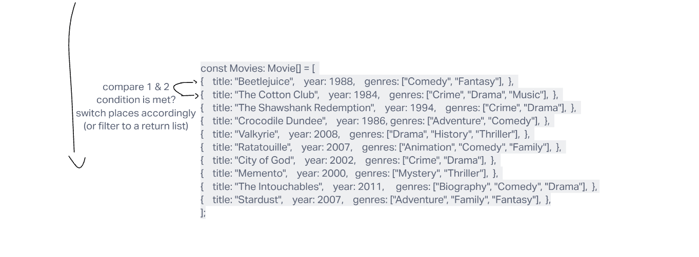

# Code Challenge

Implement several array sorting comparators and an array filter.

## Specifications

- Read all of these instructions carefully.
- Name things exactly as described.
- Do all your work in a your `data-structures-and-algorithms` public repository.
- Create a new branch in your repo named as noted below.
- Follow the language-specific instructions for the challenge type listed below.
- Update the "Table of Contents" - in the README at the root of the repository - with a link to this challenge's README file.

### Challenge Setup & Execution

**Branch Name:** `movies`

**Challenge Type:** Code Challenge / Algorithm

## Feature Tasks

[x] Implement the functions `sortYear`, `sortTitle`, and `inGenre` in the file `sort.ts`.

  [x] Execute your tests while developing using `npm run watch`
  [x] Execute your tests in CI using `npm test`

[x] Functions:
  [x] sortYear: Arguments: `movies` array, Sorts the input array by year, in ascending order.
  [x] sortTitle: Arguments: `movies` array, Sorts the input array by title, ignoring `"The "` at the beginning of titles.
  [x] inGenre: Arguments: `movies` array, `genre` string, Filters the input array, returning only those movies who include `genre`.

[] Extract the comparator callbacks
  [] sortYear and sortTitle should both be implemented by passing a custom comparison function to the built-in sort utility.
  [] Export these helper functions at the top level of your file, and call them from your sortYear and sortTitle functions.
  [] Import these helper functions into your test, and write tests that verify they return the appropriate comparison values (<0, 0, or >0).

## Visualization

## Requirements

Ensure your complete solution follows the standard requirements.

1. Write additional [unit tests](../../Challenge_Testing){:target="\_blank"}
1. Follow the [template for a well-formatted README](../../Challenge_Documentation){:target="\_blank"}
1. Submit the assignment following [these instructions](../../Challenge_Submission){:target="\_blank"}
